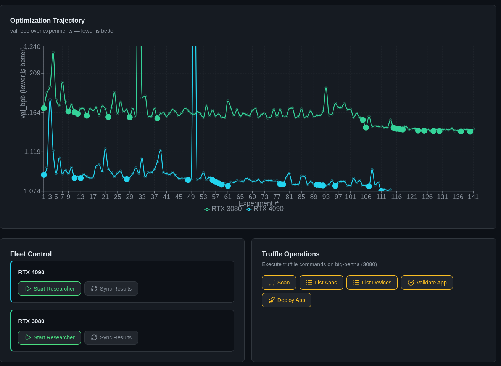

# truffle-autoresearch

automated ML research on personal hardware, coordinated by a Truffle device.

## what is this

a framework for running [Karpathy-style autoresearch](https://github.com/karpathy/autoresearch) on your own GPUs. you define a target (any training script with a scalar eval metric), point it at your machines, and it runs autonomous experiments overnight. a [Truffle](https://truffle.bot) device coordinates the fleet.

v1 proved the concept: 264 experiments across a 4090 and 3080, running in parallel overnight. same algorithm, same code, different hardware. they converged on completely different optimal architectures. full writeup and code in [v1-initial-experimentation/](./v1-initial-experimentation/).

## v1 results

| | RTX 4090 | RTX 3080 |
|---|---|---|
| **Experiments** | 117 | 147 |
| **Baseline val_bpb** | 1.092496 | 1.168815 |
| **Best val_bpb** | 1.074108 | 1.141978 |
| **Improvement** | 1.68% | 2.30% |

the 4090 found sliding window attention and ADAM_BETAS=(0.85, 0.95). the 3080 found depth scaling and tight softcap. ADAM_BETAS was the 4090's biggest single win but was rejected on the 3080. same change, different hardware, opposite result.

both GPUs figured out that throughput beats model size under a fixed time budget. after that shared discovery, they went in completely different directions. the 4090 went architectural (short windows, VE gating). the 3080 went optimizer (softcap, warmdown scheduling).

see [v1-initial-experimentation/EXPERIMENT_SUMMARY.md](./v1-initial-experimentation/EXPERIMENT_SUMMARY.md) for the full breakdown.

## roadmap

### v2.0: framework foundation

- **swappable targets.** right now the target is hardcoded as Karpathy's toy LM. v2 makes targets pluggable. a target is just a directory: train.py + eval metric + program.md + config.yaml. `autoresearch init my-target` scaffolds one.
- **shipped targets:** toy-lm (current), speculative decoding (draft model optimization, tokens/sec), music transformer (audio quality, FAD score).
- **fleet config as code.** fleet.yaml defines your machines, GPUs, access method, which targets they can run. replaces hardcoded python dicts.
- **structured results.** SQLite or DuckDB instead of TSV. every hyperparameter change tracked, parent experiment relationships, queryable.
- **proper CLI.** `autoresearch run <target> <machine>`, `autoresearch status`, `autoresearch compare`. wraps the bash loop + control server into one tool.

### v2.5: intelligence layer

- **cross-machine experiment sharing.** when machine A finds a keep, machine B's agent sees it as a suggestion. "4090 found ADAM_BETAS=(0.85, 0.95) was a big win. worth testing here?"
- **plateau detection.** the 3080 had 69 consecutive discards before it tried depth scaling. the framework should detect plateaus and nudge the agent toward architectural changes.
- **dynamic prompting.** construct the agent prompt from experiment history, cross-machine insights, and target-specific heuristics. not a static program.md.
- **experiment genealogy.** track parent-child relationships. visualize as a tree, not a timeline.

### v3.0: truffle as orchestrator

- **truffle becomes the fleet manager, not just a monitor.** start/stop targets on any machine via MCP tools. allocate targets based on GPU capability.
- **truffile-chat in the dashboard.** embedded chat that talks to Truffle MCP tools or uses Claude-in-Claude (Anthropic API with control server endpoints as tools). ask "what's the best result on speculative decoding?" and get a real answer.
- **cloud GPU integration.** Vast.ai Python SDK for ephemeral H200/A100 rentals. spin up, run experiments, tear down.
- **proactive suggestions.** "3080 has been plateaued for 40 experiments. switch targets?" or "cloud H200 has been idle for 2 hours."

### v3.5: official truffle integration

- ship autoresearch coordinator as an official Truffle integration. anyone with a Truffle + GPUs installs it and starts running experiments.
- opt-in anonymous result sharing across users. "what's the best toy-lm config found by any 3080?" Karpathy's SETI@home vision for hyperparameter search.
- community-contributed targets via PR.

## target roadmap

### speculative decoding (next up)

find the optimal draft model for a given verifier. metric: accepted tokens per second. the thesis extends here too: Truffle's 64GB unified memory can fit verifier + large draft model together. different hardware, different optimal draft size.

### music transformer

small music generation model, optimize for audio quality (FAD score or similar). interesting search space, personally exciting, slower eval cycle (10-15 min budget).

## v1 architecture reference

the [v1-initial-experimentation/](./v1-initial-experimentation/) folder contains the full original project: control server, dashboard, truffle app, experiment data, and loop scripts. see [v1-initial-experimentation/README.md](./v1-initial-experimentation/README.md) for architecture diagrams and setup instructions.

## credits

- [Karpathy's autoresearch](https://github.com/karpathy/autoresearch): the original pattern. give an LLM a training script and let it run experiments autonomously.
- [Truffle / Deepshard](https://truffle.bot): the device and runtime that coordinates everything from a single Jetson.
- Claude (Anthropic): the autonomous researcher agent.
