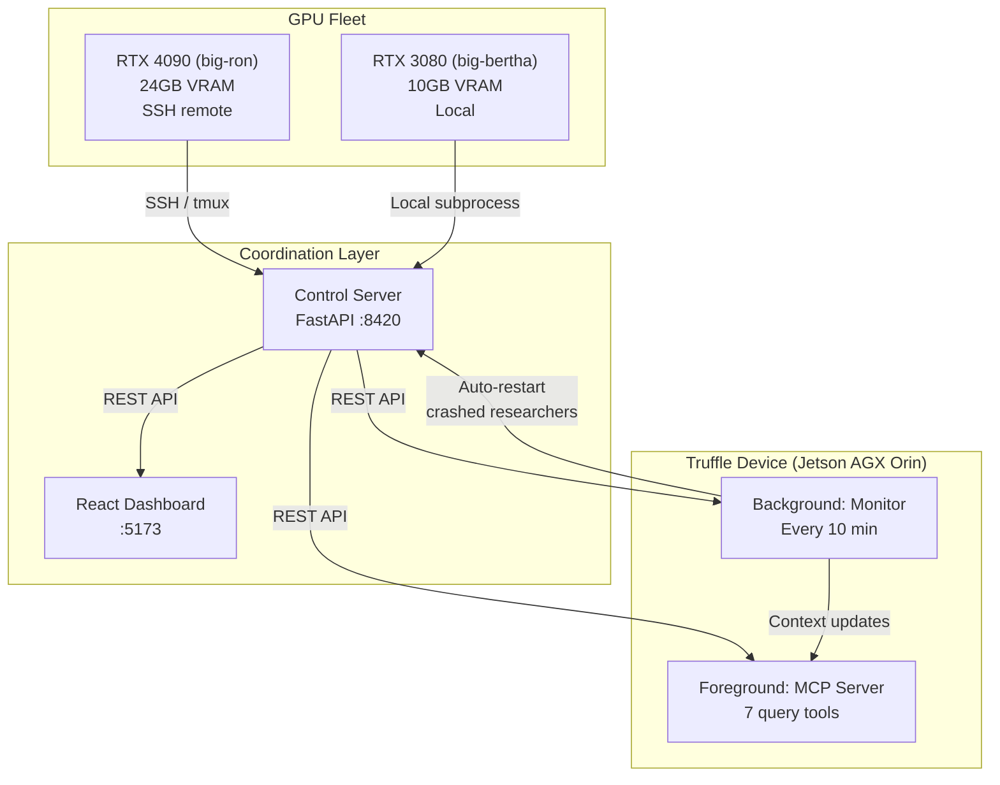

# truffle-autoresearch

**Same algorithm, same code, different hardware → different intelligence.**

i ran [Karpathy's autoresearch](https://github.com/karpathy/autoresearch) on every GPU i own: a 4090 and a 3080, running in parallel overnight, coordinated by a [Truffle](https://truffle.bot) device sitting on a Jetson. each GPU ran experiments autonomously, starting from the same baseline. they both independently figured out that throughput beats model size. then they diverged completely. different architectures, different optimizers, different everything.

the thesis is simple: autoresearch has a fixed 5-minute training budget. a 4090 cranks through way more steps than a 3080 in that window. so the same search algorithm, given different hardware, explores a different landscape and lands on different answers.

## results

264 experiments. two GPUs. multiple overnight runs. i went to sleep and woke up to this:

| | RTX 4090 ("big-ron") | RTX 3080 ("big-bertha") |
|---|---|---|
| **VRAM** | 24 GB | 10 GB |
| **Experiments** | 117 | 147 |
| **Keeps** | ~17 | ~15 |
| **Baseline val_bpb** | 1.092496 | 1.168815 |
| **Best val_bpb** | **1.074108** | **1.141978** |
| **Improvement** | -1.68% | -2.30% |

### what each GPU landed on

**RTX 4090**: went lean and architectural:
- `DEPTH=8`, MLP 2x expansion, Value-Embed (VE) on every layer
- `ve_gate=4`, `short_window=64` (sliding window attention)
- `ADAM_BETAS=(0.85, 0.95)`, QK norm before RoPE
- trajectory: baseline → LR tuning → short window sweep (big win) → MLP narrowing → VE gate tuning → QK norm reorder → ADAM_BETAS breakthrough

**RTX 3080**: went wide and focused on regularization:
- `DEPTH=8`, `AR=48`, `softcap=9`, MLP 3x expansion
- `WARMDOWN=0.65`, `MATRIX_LR=0.075`, `FINAL_LR_FRAC=0.1`
- trajectory: baseline (DEPTH=6) → hyperparameter tuning → DEPTH=8 breakthrough → softcap sweep → warmdown/LR tuning

### the interesting part

both GPUs figured out that **more steps > bigger model**. every "make it bigger" attempt failed because fewer steps fit in 5 minutes. but after that shared discovery, they went in completely different directions. the 4090 found wins in architecture (sliding window attention, VE gating). the 3080 found wins in optimizer tuning (softcap, warmdown scheduling). same search algorithm, genuinely different research paths.

## architecture



each GPU runs a Claude agent in an infinite loop. the control server talks to both (SSH for the 4090, local for the 3080). the dashboard gives you a live view. the Truffle app on the Jetson watches everything and auto-restarts crashed researchers so you can actually sleep.

## how the loop works

the core is `autoresearch_loop.sh`, a bash while-true that spawns Claude sessions:

```
┌─────────────────────────────────────────────┐
│  autoresearch_loop.sh <machine-id>          │
│                                             │
│  1. Create git branch autoresearch/<id>     │
│  2. Loop forever:                           │
│     a. Spawn: claude -p --model opus        │
│        └─ Read program.md + results.tsv     │
│        └─ Pick a new hyperparameter idea    │
│        └─ Edit train.py                     │
│        └─ Run: uv run train.py (~5 min)     │
│        └─ Check val_bpb in run.log          │
│        └─ Improved? Keep commit : Revert    │
│        └─ Log result to results.tsv         │
│        └─ Repeat until session timeout      │
│     b. Sync results to GitHub               │
│     c. Sleep 10s, restart agent             │
└─────────────────────────────────────────────┘
```

the agent reads `program.md` for the rules and `results.tsv` so it doesn't repeat failed experiments. it can only edit `train.py`. everything else is locked down. wins advance the git branch, losses get reverted.

there's a 2-hour session timeout. if the agent gets stuck or context gets too long, the outer loop kills it and spawns a fresh one. `results.tsv` carries all the history forward.

## repo structure

```
truffle-autoresearch/
├── autoresearch/                 # Core ML experiment workspace
│   ├── program.md                # Agent protocol (rules of the game)
│   ├── train.py                  # The model, only file the agent edits
│   ├── prepare.py                # Data prep + eval (read-only)
│   ├── results.tsv               # Experiment log (kept per-machine)
│   └── pyproject.toml            # Python dependencies
├── control-server/               # Fleet coordination
│   ├── server.py                 # FastAPI server (SSH to 4090, local 3080)
│   ├── run.sh                    # Launch script (auto-loads .env)
│   └── requirements.txt          # Server dependencies
├── truffle-app/                  # Truffle device app
│   ├── truffile.yaml             # App manifest (foreground + background)
│   ├── coordinator_foreground.py  # MCP server, 7 query tools
│   ├── coordinator_background.py  # Scheduled monitor (every 10 min)
│   ├── data_reader.py            # HTTP client to control server
│   └── config.py                 # Machine definitions
├── dashboard/                    # React web UI
│   ├── src/App.jsx               # Main app (polling, auth, layout)
│   └── src/components/           # FleetStatus, Trajectory, Controls, Logs
├── results/                      # Exported results (synced to main branch)
│   ├── 4090-results.tsv          # RTX 4090 experiment history
│   └── 3080-results.tsv          # RTX 3080 experiment history
├── autoresearch_loop.sh          # Infinite agent loop launcher
├── sync_results.sh               # Git sync helper
└── .env.example                  # Environment variables template
```

## running it yourself

### prerequisites

- NVIDIA GPU(s) with CUDA
- [Claude Code](https://docs.anthropic.com/en/docs/claude-code) CLI (`claude` command)
- [uv](https://github.com/astral-sh/uv)
- Python 3.11+
- Node.js 18+ (dashboard only)
- [Truffle](https://truffle.bot) device (optional)

### setup

1. **clone and configure**
   ```bash
   git clone https://github.com/youruser/truffle-autoresearch.git
   cd truffle-autoresearch
   cp .env.example .env
   # Fill in CONTROL_API_TOKEN, SSH_HOST_4090, SSH_USER_4090
   ```

2. **prepare training data**
   ```bash
   cd autoresearch
   uv sync
   uv run prepare.py
   ```

3. **start the control server**
   ```bash
   cd control-server
   bash run.sh
   # Runs on http://localhost:8420
   ```

4. **start the dashboard** (optional)
   ```bash
   cd dashboard
   npm install && npm run dev
   # Runs on http://localhost:5173
   ```

5. **launch a researcher**
   ```bash
   bash autoresearch_loop.sh 4090   # or 3080, or whatever you call your machine
   ```

6. **deploy the Truffle app** (optional)
   ```bash
   cd truffle-app
   truffile deploy
   ```

leave it running overnight. ~12 experiments per hour, ~100 by morning.

## the Truffle app

the Truffle app runs on a Jetson AGX Orin and does two things:

**foreground (MCP server)**: 7 tools you can call to check on your fleet:

| Tool | Description |
|---|---|
| `get_experiment_status` | Current counts and best val_bpb per machine |
| `get_optimization_trajectory` | Full experiment list with `is_new_best` annotations |
| `compare_platforms` | Side-by-side cross-machine comparison with leader |
| `start_researcher` | Start the autonomous research loop |
| `stop_researcher` | Stop the research loop |
| `sync_results` | Trigger result sync to GitHub |
| `get_researcher_logs` | Recent log output from the researcher |

**background (monitor)**: runs every 10 minutes:
- detects new experiments and researcher crashes
- auto-restarts stopped researchers
- submits high-priority context for crashes and new bests
- posts heartbeats to the control server

the background monitor is the reason you can leave this running overnight. researcher crashes at 3am? the Jetson restarts it.

## credits

- [Karpathy's autoresearch](https://github.com/karpathy/autoresearch): the original pattern. give an LLM a training script and let it run experiments autonomously
- [Truffle / Deepshard](https://truffle.bot): the device and runtime that makes fleet-level coordination possible from a single Jetson
- Claude (Anthropic): the autonomous researcher agent, running with `--dangerously-skip-permissions` so it can train models at 3am without asking
